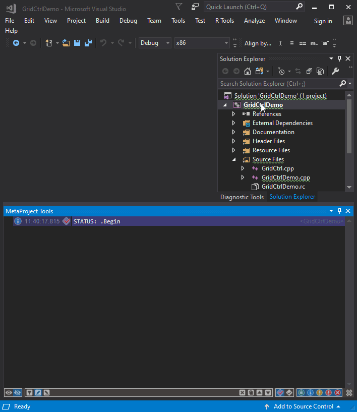

---

Supported only output related functionality.

Project related functionality is in development.

---

## This video demonstrates just tiny part of [MetaOutput](https://marketplace.visualstudio.com/items?itemName=ViacheslavLozinskyi.MetaOutput-2022) possibilities (it's part of MetaProject):

---

## This video on YouTube is official MetaOutput presentation:

Direct link to this presentation on YouTube is [here](https://www.youtube.com/watch?v=_BO40nyx0Qw?autoplay=1)

Direct link to this presentation in PDF is [here](https://github.com/viacheslav-lozinskyi/MetaOutput/blob/main/resource/document/MetaOutput.pdf)

Direct link to this presentation in PowerPoint format is [here](https://github.com/viacheslav-lozinskyi/MetaOutput/blob/main/resource/document/MetaOutput.pptx)

---

## Publications about MetaProject
- [Evolution of every developer's most popular tool (in Visual Studio)](https://habr.com/ru/post/458300/)

---

## Prerequisites
- **Visual Studio** 2015, 2017, 2019, 2022
- **.NET Framework** 4.7.2+

---

## Downloads:

Download from [Visual Studio Marketplace](https://marketplace.visualstudio.com/items?itemName=ViacheslavLozinskyi.MetaProject)
