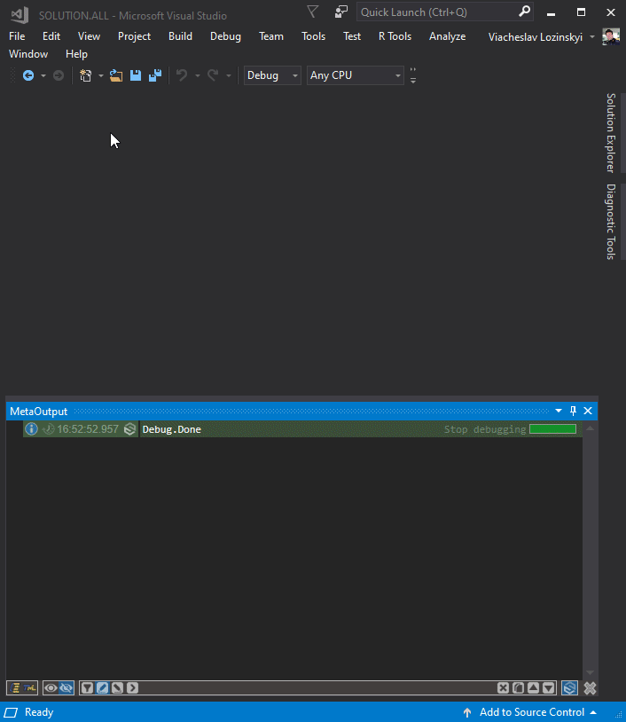

<h2>Features</h2>
<ul>
<li>Simultaneous management of outputs for different platforms;
<li>Visualization of output in all modes (Build / Debug);
<li>Grouping of outputs from all sources (Build / Debug and other) in one list;
<li>Automatic definition of message signatures by which is possible it visualization and masking;
<li>Visual segregation (errors / warnings / messages) by colors and icons;
<li>Color changing of messages in accordance with preferences;
<li>Removal and establishment of messages masking in accordance with preferences;
<li>Grouping of additional information in a single message;
<li>Showing of appearance time for each message;
<li>Removing unnecessary information from messages;
<li>Search for requested messages;
<li>Showing of the source file which is associated with message;
<li>Support Visual Studio color scheme;
<li>… and much more.
</ul>

<h2>Publications about MetaProject</h2>
<ul>
<li><a href='https://habr.com/ru/post/458300/'>Evolution of every developer's most popular tool</a>
</ul>
